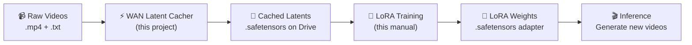

# 🎓 WAN 2.1 LoRA Training Manual

> **Using cached `.safetensors` latents from the WAN Latent Cacher Engine**
> Designed for Google Colab (T4/A100 GPU)

---

## 📋 Table of Contents

1. [Overview](#overview)
2. [Prerequisites](#prerequisites)
3. [Step 1 — Cache Your Latents](#step-1--cache-your-latents)
4. [Step 2 — Prepare Training Data](#step-2--prepare-training-data)
5. [Step 3 — Install Training Dependencies](#step-3--install-training-dependencies)
6. [Step 4 — Configure Training](#step-4--configure-training)
7. [Step 5 — Launch Training](#step-5--launch-training)
8. [Step 6 — Monitor Training](#step-6--monitor-training)
9. [Step 7 — Save & Export LoRA](#step-7--save--export-lora)
10. [Step 8 — Inference with Your LoRA](#step-8--inference-with-your-lora)
11. [Troubleshooting](#troubleshooting)

---

## Overview



**Why cache latents first?**
- Training directly on raw video = repeated VAE encoding every epoch = wasted GPU time
- Cached latents skip the VAE entirely during training → **3-5x faster training**
- `.safetensors` on Drive means you never lose progress if Colab disconnects

---

## Prerequisites

| Requirement | Details |
|------------|---------|
| **GPU** | T4 (16GB) minimum, A100 (40GB) recommended |
| **Colab** | Google Colab Pro recommended for longer sessions |
| **Latents** | 10-20 cached `.safetensors` files from the WAN Latent Cacher |
| **Drive** | Latents synced to Google Drive via the Cacher's Drive Sync tab |

---

## Step 1 — Cache Your Latents

If you haven't already, run the WAN Latent Cacher first:

```python
# In Colab
!pip install -r wan_cacher_engine/requirements.txt
!python wan_cacher_engine/app.py
```

1. **📂 Data Manager tab** → Upload your `.mp4` + matching `.txt` caption files
2. **⚡ Encode & Cache tab** → Click **"▶ Start Caching Pipeline"**
3. **☁️ Drive Sync tab** → Mount Drive → **"Sync All to Drive"**

> [!IMPORTANT]
> Each `.mp4` must have a matching `.txt` with the **exact same filename**.
> Example: `dancing_cat.mp4` → `dancing_cat.txt`

Your latents are now at: `/content/drive/MyDrive/wan_latents/`

---

## Step 2 — Prepare Training Data

Verify your cached data structure on Drive:

```python
import os, glob

LATENT_DIR = "/content/drive/MyDrive/wan_latents"

safetensors = sorted(glob.glob(os.path.join(LATENT_DIR, "*.safetensors")))
captions = sorted(glob.glob(os.path.join(LATENT_DIR, "*.txt")))

print(f"Latents: {len(safetensors)}")
print(f"Captions: {len(captions)}")

# Verify pairs match
for st in safetensors:
    stem = os.path.splitext(os.path.basename(st))[0]
    txt = os.path.join(LATENT_DIR, f"{stem}.txt")
    status = "✅" if os.path.exists(txt) else "❌ MISSING"
    print(f"  {stem}: {status}")
```

> [!TIP]
> **Recommended dataset size:** 10-20 videos for a character/style LoRA, 30-50 for more complex concepts. Quality > quantity — curate your clips carefully.

---

## Step 3 — Install Training Dependencies

```python
# Core training stack
!pip install torch>=2.4.0 torchvision torchaudio --index-url https://download.pytorch.org/whl/cu124
!pip install diffusers>=0.33.0 transformers>=4.48.0 accelerate>=1.1.0
!pip install peft>=0.14.0 safetensors>=0.4.5 einops>=0.8.0
!pip install xformers>=0.0.28
!pip install wandb  # optional, for logging
```

---

## Step 4 — Configure Training

Create your training config. These hyperparameters are tuned for **T4 16GB** with cached latents:

```python
# ── Training Configuration ──────────────────────────────────────────

CONFIG = {
    # Model
    "model_id": "Wan-AI/Wan2.1-T2V-1.3B",

    # Data
    "latent_dir": "/content/drive/MyDrive/wan_latents",

    # LoRA
    "lora_rank": 32,              # Higher = more capacity, more VRAM (16-128)
    "lora_alpha": 32,             # Usually same as rank
    "lora_target_modules": [      # Which layers to adapt
        "to_q", "to_k", "to_v", "to_out.0",  # Attention
        "ff.net.0.proj", "ff.net.2",           # Feed-forward
    ],
    "lora_dropout": 0.05,

    # Training
    "learning_rate": 1e-4,        # Start here, lower to 5e-5 if unstable
    "epochs": 50,                 # With 15 videos, this = 750 steps
    "batch_size": 1,              # Keep at 1 for T4, 2-4 for A100
    "gradient_accumulation": 4,   # Effective batch = batch_size × this
    "warmup_steps": 50,
    "max_grad_norm": 1.0,

    # Optimizer
    "optimizer": "adamw",         # Use "adamw8bit" for lower VRAM via bitsandbytes
    "weight_decay": 0.01,

    # Checkpoints (save to Drive!)
    "save_every_n_epochs": 10,
    "checkpoint_dir": "/content/drive/MyDrive/wan_lora_checkpoints",

    # Mixed precision
    "mixed_precision": "fp16",    # Essential for T4
}
```

> [!WARNING]
> **T4 memory limits:** Keep `batch_size=1` and `lora_rank≤64` on T4.
> For A100, you can increase to `batch_size=4` and `lora_rank=128`.

---

## Step 5 — Launch Training

Here's the complete training script using your cached latents:

```python
import os
import gc
import glob
import torch
from safetensors.torch import load_file, save_file
from diffusers import WanTransformer3DModel
from peft import LoraConfig, get_peft_model
from torch.utils.data import Dataset, DataLoader


# ── Dataset: Loads pre-cached latents ────────────────────────────────

class CachedLatentDataset(Dataset):
    """Loads .safetensors latents + .txt captions from disk."""

    def __init__(self, latent_dir):
        self.files = sorted(glob.glob(os.path.join(latent_dir, "*.safetensors")))
        if not self.files:
            raise FileNotFoundError(f"No .safetensors in {latent_dir}")
        print(f"📦 Loaded {len(self.files)} cached latents")

    def __len__(self):
        return len(self.files)

    def __getitem__(self, idx):
        sf_path = self.files[idx]
        stem = os.path.splitext(os.path.basename(sf_path))[0]
        txt_path = os.path.join(os.path.dirname(sf_path), f"{stem}.txt")

        # Load latent
        data = load_file(sf_path)
        latent = data["latent"]

        # Load caption
        with open(txt_path, "r", encoding="utf-8") as f:
            caption = f.read().strip()

        return {"latent": latent, "caption": caption, "name": stem}


# ── Model Setup ──────────────────────────────────────────────────────

def setup_model_with_lora(config):
    """Load Wan 2.1 transformer and attach LoRA adapters."""

    print("🔄 Loading Wan 2.1 Transformer...")
    transformer = WanTransformer3DModel.from_pretrained(
        config["model_id"],
        subfolder="transformer",
        torch_dtype=torch.float16,
    )

    # Attach LoRA
    lora_config = LoraConfig(
        r=config["lora_rank"],
        lora_alpha=config["lora_alpha"],
        target_modules=config["lora_target_modules"],
        lora_dropout=config["lora_dropout"],
        bias="none",
    )

    transformer = get_peft_model(transformer, lora_config)
    transformer.print_trainable_parameters()
    transformer.to("cuda")
    transformer.train()

    return transformer


# ── Training Loop ────────────────────────────────────────────────────

def train(config):
    """Main training loop using cached latents."""

    # Setup
    transformer = setup_model_with_lora(config)
    dataset = CachedLatentDataset(config["latent_dir"])
    dataloader = DataLoader(dataset, batch_size=config["batch_size"], shuffle=True)

    # Text encoder for caption conditioning
    from transformers import AutoTokenizer, AutoModel
    tokenizer = AutoTokenizer.from_pretrained(config["model_id"], subfolder="tokenizer")
    text_encoder = AutoModel.from_pretrained(
        config["model_id"],
        subfolder="text_encoder",
        torch_dtype=torch.float16,
    ).to("cuda").eval()

    # Optimizer
    if config["optimizer"] == "adamw8bit":
        import bitsandbytes as bnb
        optimizer = bnb.optim.AdamW8bit(
            transformer.parameters(),
            lr=config["learning_rate"],
            weight_decay=config["weight_decay"],
        )
    else:
        optimizer = torch.optim.AdamW(
            transformer.parameters(),
            lr=config["learning_rate"],
            weight_decay=config["weight_decay"],
        )

    scheduler = torch.optim.lr_scheduler.CosineAnnealingLR(
        optimizer, T_max=config["epochs"] * len(dataloader)
    )

    # Checkpoint dir
    os.makedirs(config["checkpoint_dir"], exist_ok=True)

    # Training
    print(f"\n🚀 Starting training: {config['epochs']} epochs, {len(dataset)} samples")
    global_step = 0

    for epoch in range(config["epochs"]):
        epoch_loss = 0.0

        for batch_idx, batch in enumerate(dataloader):
            latent = batch["latent"].to("cuda", dtype=torch.float16)

            # Encode captions
            with torch.no_grad():
                inputs = tokenizer(
                    batch["caption"],
                    padding=True,
                    truncation=True,
                    max_length=256,
                    return_tensors="pt",
                ).to("cuda")
                text_embeds = text_encoder(**inputs).last_hidden_state

            # Add noise (diffusion training)
            noise = torch.randn_like(latent)
            timesteps = torch.randint(0, 1000, (latent.shape[0],), device="cuda").long()

            # Forward pass — predict noise
            noise_pred = transformer(
                hidden_states=latent,
                timestep=timesteps,
                encoder_hidden_states=text_embeds,
            ).sample

            # MSE loss
            loss = torch.nn.functional.mse_loss(noise_pred, noise)
            loss = loss / config["gradient_accumulation"]
            loss.backward()

            if (batch_idx + 1) % config["gradient_accumulation"] == 0:
                torch.nn.utils.clip_grad_norm_(
                    transformer.parameters(), config["max_grad_norm"]
                )
                optimizer.step()
                scheduler.step()
                optimizer.zero_grad()
                global_step += 1

            epoch_loss += loss.item() * config["gradient_accumulation"]

            # VRAM cleanup
            del latent, noise, noise_pred, text_embeds
            gc.collect()
            torch.cuda.empty_cache()

        avg_loss = epoch_loss / len(dataloader)
        print(f"  Epoch {epoch + 1}/{config['epochs']} | Loss: {avg_loss:.6f} | LR: {scheduler.get_last_lr()[0]:.2e}")

        # Save checkpoint to Drive
        if (epoch + 1) % config["save_every_n_epochs"] == 0:
            ckpt_path = os.path.join(
                config["checkpoint_dir"], f"lora_epoch_{epoch + 1}"
            )
            transformer.save_pretrained(ckpt_path)
            print(f"  💾 Checkpoint saved → {ckpt_path}")

    # Final save
    final_path = os.path.join(config["checkpoint_dir"], "lora_final")
    transformer.save_pretrained(final_path)
    print(f"\n✅ Training complete! Final LoRA → {final_path}")

    # Cleanup
    del transformer, text_encoder
    gc.collect()
    torch.cuda.empty_cache()

    return final_path


# ── Run ──────────────────────────────────────────────────────────────
final_lora_path = train(CONFIG)
```

---

## Step 6 — Monitor Training

### What to watch during training

| Signal | Healthy | Problem |
|--------|---------|---------|
| **Loss** | Decreases steadily, plateaus ~0.01-0.05 | Spikes, NaN, or stays flat |
| **VRAM** | Stable, no creep | OOM errors |
| **LR** | Cosine decay curve | N/A |

### Check VRAM usage in Colab

```python
!nvidia-smi
```

### Optional: WandB logging

Add to your training loop for live charts:

```python
import wandb
wandb.init(project="wan-lora", config=CONFIG)
# Inside epoch loop:
wandb.log({"loss": avg_loss, "epoch": epoch, "lr": scheduler.get_last_lr()[0]})
```

---

## Step 7 — Save & Export LoRA

Your checkpoints are automatically saved to Drive at:
```
/content/drive/MyDrive/wan_lora_checkpoints/
├── lora_epoch_10/
├── lora_epoch_20/
├── lora_epoch_30/
├── ...
└── lora_final/            ← Use this one
    ├── adapter_config.json
    └── adapter_model.safetensors
```

> [!TIP]
> **Picking the best checkpoint:** If your final model is overfit (generates only training clips), try an earlier checkpoint like `lora_epoch_20` or `lora_epoch_30`.

### Export as a single `.safetensors` for sharing

```python
from peft import PeftModel
from diffusers import WanTransformer3DModel

# Load base + LoRA
transformer = WanTransformer3DModel.from_pretrained(
    "Wan-AI/Wan2.1-T2V-1.3B", subfolder="transformer", torch_dtype=torch.float16,
)
transformer = PeftModel.from_pretrained(transformer, "/content/drive/MyDrive/wan_lora_checkpoints/lora_final")

# Merge LoRA into base weights
merged = transformer.merge_and_unload()

# Save merged model
merged.save_pretrained("/content/drive/MyDrive/wan_lora_merged")
print("✅ Merged model saved — ready for inference or upload to HuggingFace")
```

---

## Step 8 — Inference with Your LoRA

Generate videos using your trained LoRA:

```python
import torch
from diffusers import WanPipeline
from peft import PeftModel

# Load pipeline
pipe = WanPipeline.from_pretrained(
    "Wan-AI/Wan2.1-T2V-1.3B",
    torch_dtype=torch.float16,
)

# Load your LoRA adapter
pipe.transformer = PeftModel.from_pretrained(
    pipe.transformer,
    "/content/drive/MyDrive/wan_lora_checkpoints/lora_final",
)
pipe.to("cuda")

# Generate!
prompt = "A cat dancing in a neon-lit cyberpunk city, cinematic lighting"
video = pipe(
    prompt=prompt,
    num_frames=16,
    height=480,
    width=832,
    num_inference_steps=30,
    guidance_scale=7.5,
).frames[0]

# Save output
from diffusers.utils import export_to_video
export_to_video(video, "output.mp4", fps=8)
print("🎬 Video saved → output.mp4")
```

---

## Troubleshooting

| Issue | Fix |
|-------|-----|
| **CUDA OOM during training** | Reduce `lora_rank` to 16, set `optimizer` to `"adamw8bit"`, ensure `batch_size=1` |
| **Loss is NaN** | Lower `learning_rate` to `5e-5`, check your latent files aren't corrupted |
| **Loss doesn't decrease** | Increase `lora_rank` to 64, increase `epochs`, check captions match videos |
| **Colab disconnects mid-training** | Checkpoints auto-save to Drive — restart and load last checkpoint |
| **Generated videos look like noise** | Overfit — use an earlier checkpoint, add more training data |
| **"No .safetensors found"** | Verify your `latent_dir` path points to the correct Drive folder |

### Resume from a checkpoint after Colab disconnect

```python
from peft import PeftModel

# Load the last saved checkpoint
transformer = WanTransformer3DModel.from_pretrained(
    "Wan-AI/Wan2.1-T2V-1.3B", subfolder="transformer", torch_dtype=torch.float16,
)
transformer = PeftModel.from_pretrained(
    transformer,
    "/content/drive/MyDrive/wan_lora_checkpoints/lora_epoch_30",
    is_trainable=True,  # Critical — keeps LoRA in training mode
)
transformer.to("cuda").train()

# Continue training from epoch 31...
```
